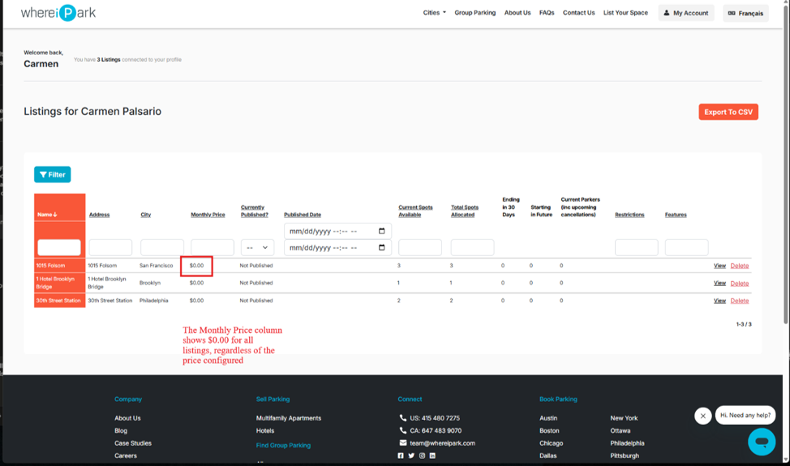
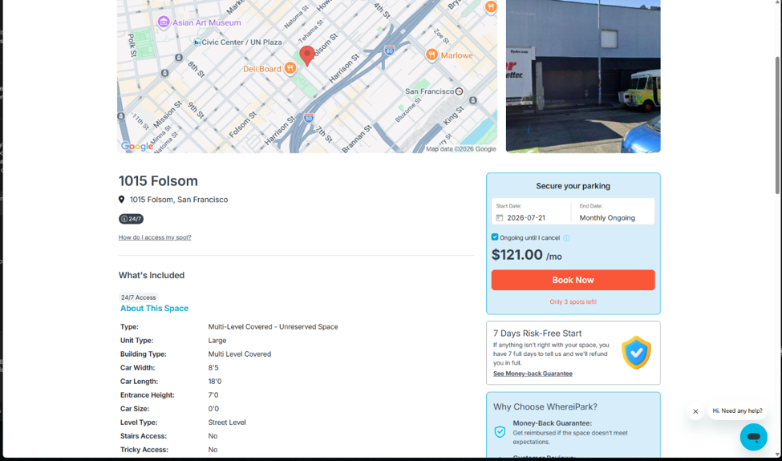

# BUG-001 — Monthly Price Not Reflected on the Listings Dashboard

| Field       | Detail                                          |
|-------------|-------------------------------------------------|
| Reported by | Carmen Palsario                                 |
| Date        | 2026-07-16                                      |
| Environment | staging.whereipark.com                          |
| Area        | Listings Dashboard — Monthly Price column       |
| Severity    | **Medium**                                      |

---

## Summary

Monthly price set during listing creation displays as `$0.00` on the listings dashboard, despite
being correctly stored and shown on the public listing page.

---

## Preconditions

- User is signed in with a valid account
- At least one listing exists with a monthly price configured (e.g. set to `$121.00` during the
  Create Listing wizard)

---

## Steps to Reproduce

1. Sign in to `staging.whereipark.com`
2. Navigate to `/listings`
3. Observe the **Monthly Price** column in the listings table

---

## Expected Result

The Monthly Price column displays the price set during listing creation (e.g. `$121.00`).

## Actual Result

The Monthly Price column shows `$0.00` for all listings, regardless of the price configured.

---

## Evidence

### Screenshot 1 — Listings dashboard showing $0.00 for all listings

> The Monthly Price column displays `$0.00` for "1015 Folsom", "1 Hotel Brooklyn Bridge", and
> "30th Street Station" — all listings show the same incorrect value regardless of the price set.

---

### Screenshot 2 — Listing detail page showing correct price of $121.00/mo

> Navigating to the "1015 Folsom" listing detail page shows `$121.00 /mo` in the booking widget,
> confirming the price is stored correctly. The discrepancy is isolated to the dashboard display.

---

## Impact

- **Listing owners** — see a misleading dashboard that makes every listing appear unpriced, which
  may cause confusion or erroneous re-editing of prices
- **Support and ops teams** — relying on the dashboard to audit pricing would get inaccurate data
- **Trust** — a host new to the platform who sets a price and immediately checks the dashboard
  would reasonably assume the price was not saved

---

## Severity Justification

Rated **Medium**: data is not lost (the listing detail page shows the correct value), but the
dashboard misrepresents it in a way that is visible to every logged-in host. No booking or
financial data is corrupted, but the UX impact is significant for host confidence.
